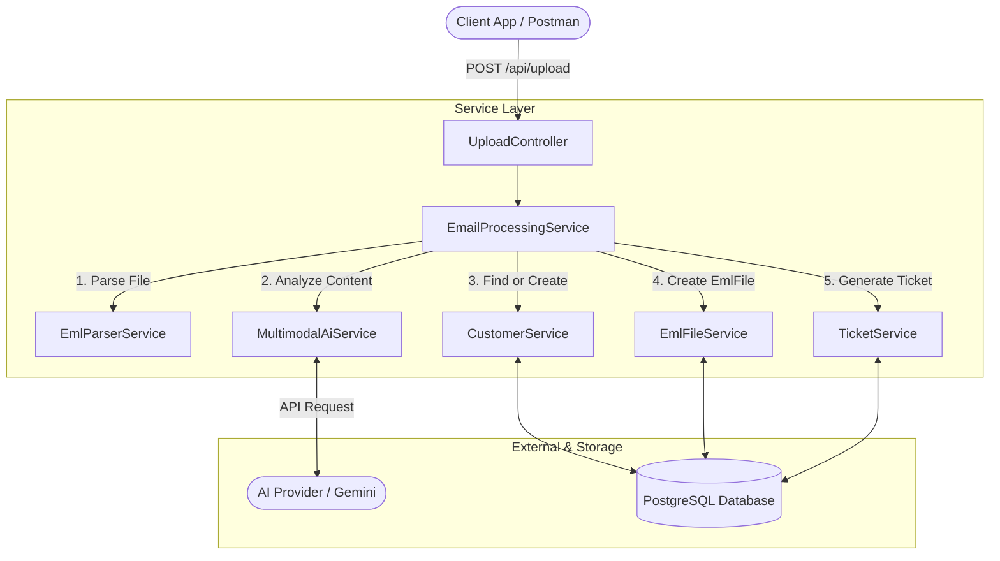
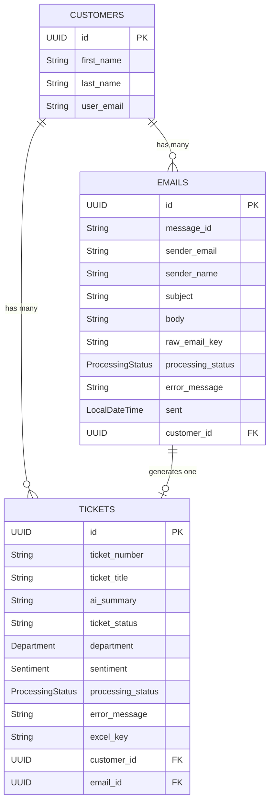

# Mail-2-Ticket

A backend service built with Spring Boot that converts `.eml` files into support tickets. The system reads email files, extracts text and attachments and uses a multimodal AI model to analyze the content and route each ticket to the correct department.


---

## Core Features

- **Email Parsing**: Reads `.eml` files using `simple-java-mail`, extracting metadata, plain text, HTML (stripped via Jsoup) and binary attachments. Duplicate emails are rejected using the `message_id` field.
- **Multimodal AI Analysis**: Forwards email text and permitted attachments to Gemini in a single request, receiving a structured JSON response mapped to `AiEmlAnalysis`.
- **Sentiment & Department Routing**: The AI assigns a `Sentiment` (`THREATENING`, `ANGRY`, `FRUSTRATED`, `NEUTRAL`, `SATISFIED`, `POSITIVE`) and a `Department` (`SALES`, `LEGAL`, `TECH`, `ACCOUNTING`, `HR`). A keyword-based fallback (`Sentiment.guessFromTextFallback`) is available if AI analysis fails.
- **Processing Status Tracking**: Each `EmlFile` and `Ticket` carries a `ProcessingStatus` (`SUCCESS`, `PARTIAL_SUCCESS`, `MANUAL_CHECK_REQUIRED`) reflecting how completely the programm could parse the email and AI could analyze the email.
- **Progress Metrics**: `CustomerDto.Detail` includes `emailProgress` and `ticketProgress` — the percentage of successfully processed emails and resolved/closed tickets.

---

## Architecture & Design

The application follows a multi-layer Spring Boot architecture, separating web requests, business logic and database access.



## How it works

An uploaded `.eml` file is parsed into a `ParsedMail` object and sent to Gemini alongside any permitted attachments. The AI returns an `AiEmlAnalysis` JSON object containing the customer name, ticket title, summary, `Department` and `Sentiment`. The pipeline then finds or creates the `Customer`, persists the `EmlFile`, and creates a linked `Ticket`. The system prompt can be modified in `AiAnalysisMapperImpl.java` at `buildPrompt()`.

---

## Entity Relations

`Department` and `Sentiment` are Java enums stored as string columns directly on the `tickets` table.



---

## API Endpoints

### Upload

| Method | Endpoint | Description |
| :--- | :--- | :--- |
| **POST** | `/api/upload` | Upload a multipart `.eml` file. Triggers parsing, AI analysis, customer lookup and ticket creation. Returns `UploadResponse` with the three created entity IDs. |

### Tickets

| Method | Endpoint | Description |
| :--- | :--- | :--- |
| **GET** | `/api/tickets` | List all tickets (summary). |
| **GET** | `/api/tickets/{id}` | Get full details of a specific ticket. |
| **POST** | `/api/tickets` | Manually create a ticket (no email required). |
| **PUT** | `/api/tickets/{id}` | Update a ticket's title, summary, status, department or sentiment. |
| **DELETE** | `/api/tickets/{id}` | Delete a ticket by ID. |

### Customers

| Method | Endpoint | Description |
| :--- | :--- | :--- |
| **GET** | `/api/customers` | List all customers (summary). |
| **GET** | `/api/customers/{id}` | Get full details of a customer including linked emails, tickets and progress metrics. |
| **PUT** | `/api/customers/{id}` | Update a customer's name or email. |
| **DELETE** | `/api/customers/{id}` | Delete a customer and cascade-remove their tickets and emails. |
| **GET** | `/api/customers/{customerId}/tickets` | List all tickets belonging to a specific customer. |

### EML Files

| Method | Endpoint | Description |
| :--- | :--- | :--- |
| **GET** | `/api/emails` | List all stored EML file records (summary). |
| **GET** | `/api/emails/{id}` | Get full details of a specific EML file record. |
| **PUT** | `/api/emails/{id}` | Manually update the processing status or error message of an EML file. |
| **DELETE** | `/api/emails/{id}` | Delete an EML file record by ID. |

> **Note:** There is no `POST /api/customers` endpoint. Customers are created through the upload pipeline. If required, there is a working method in `CustomerService`: `createCustomer()`.

---

## Setup

### Requirements

- Java 25
- Maven (or use the provided `./mvnw` wrapper)
- Docker & Docker Compose (for the local PostgreSQL instance)
- API key (Google Gemini is recommended because it is free)

### Configuration

The application is configured via `src/main/resources/application.yml`. Supply secrets as environment variables in `.env` or in your IDE.

```yaml
spring:
  datasource:
    url: jdbc:postgresql://localhost:5432/postgres
    username: postgres
    password: ${DB_PASSWORD}
  ai:
    google:
      genai:
        api-key: ${GOOGLE_API_KEY}
        chat:
          options:
            model: gemini-2.5-flash
```

### Running locally

1. Start the PostgreSQL database using Docker:

```bash
docker compose up -d
```

2. Run the Spring Boot application:

```bash
./mvnw spring-boot:run
```

---

## Project Structure

```text
├── docker-compose.yml
├── mvnw / pom.xml
└── src/main/java/.../mail2ticket/
    ├── config/             Allowed attachment MIME types
    ├── controller/         REST endpoints (Upload, Ticket, Customer, EmlFile)
    ├── domain/
    │   ├── entities/       JPA entities and enums (Department, Sentiment, TicketStatus, ProcessingStatus)
    │   ├── dto/            API request/response records
    │   └── internal/       Internal pipeline models (ParsedMail, AiEmlAnalysis, UploadResponse)
    ├── exception/          GlobalExceptionHandler and custom exceptions
    ├── mapper/             Entity ↔ DTO conversion and AI response parsing
    ├── repositories/       Spring Data JPA repositories
    └── services/           Business logic and pipeline orchestration
```

---

## Planned Updates

- **Storage Service**: The `StorageService` interface is stubbed out for a future update that will upload raw `.eml` files and generated Excel exports to AWS S3.
- **Expanded Testing**: Unit tests are currently limited to `CustomerServiceImplTest`. Coverage for `TicketService`, `EmlParserService`, `MultimodalAiService` and the mapper layer is planned.
- **React Frontend**: The UI is currently basic HTML. React is planned for better visualization of the data and endpoints.
