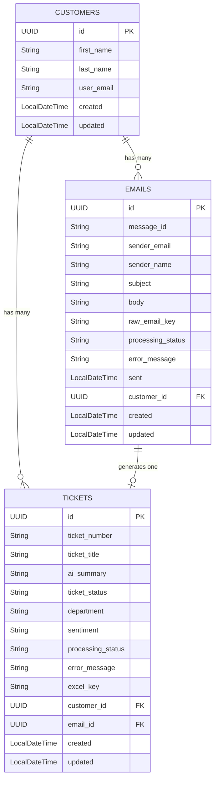

# Mail-2-Ticket

A backend service built with Spring Boot that converts `.eml` files into support tickets. The system reads email files, extracts text and attachments and uses a multimodal AI model to analyze the content and route each ticket to the correct department.

---

## Architecture & Design

The application follows multi-layer Spring Boot architecture, separating web requests, business logic and database access.


## How it works

1. A `.eml` file is uploaded to the application via `POST /api/upload`.
2. The `EmlParserService` reads the file, extracting the sender, subject, body text and isolating any `AttachmentData` whose MIME types are permitted by `AttachmentProperties`.
3. The `ParsedMail` content is sent to the `MultimodalAiService`, which builds a multimodal prompt (text + attachments) and forwards it to the configured AI model. The system prompt can be modified in `AiAnalysisMapperImpl.java` at `buildPrompt()`.
4. The AI responds with a structured JSON object (`AiEmlAnalysis`) containing: extracted customer name, a concise ticket title, an email summary, a `Department` enum value, a `Sentiment` enum value and a flag indicating whether any content could not be analyzed.
5. The `CustomerService` checks whether the sender already exists by email, creating a new `Customer` record only if they do not.
6. The `EmlFileService` persists the parsed email metadata as an `EmlFile` entity.
7. The `TicketService` creates a `Ticket` linking the `Customer`, `EmlFile`, `Sentiment` and `Department`. The `ProcessingStatus` is set to `SUCCESS` or `PARTIAL_SUCCESS` depending on whether the AI flagged any unanalyzed content.
8. The API responds with an `UploadResponse` containing the UUIDs of the newly created `Customer`, `EmlFile` and `Ticket`.

---

## Entity Relations

`Department` and `Sentiment` are Java enums stored as string columns directly on the `tickets` table - they are not separate database tables.



---

## API Endpoints

### Upload

| Method | Endpoint | Description |
| :--- | :--- | :--- |
| **POST** | `/api/upload` | Upload a multipart `.eml` file. Triggers parsing, AI analysis, customer lookup and ticket creation. Returns `UploadResponse` with the three created entity IDs. |

### Tickets

| Method | Endpoint | Description |
| :--- | :--- | :--- |
| **GET** | `/api/tickets` | Retrieve a list of all tickets (summary). |
| **GET** | `/api/tickets/{id}` | Retrieve full details of a specific ticket. |
| **POST** | `/api/tickets` | Manually create a ticket (no email required). |
| **PUT** | `/api/tickets/{id}` | Update an existing ticket's title, summary, status, department, or sentiment. |
| **DELETE** | `/api/tickets/{id}` | Delete a ticket by ID. |

### Customers

| Method | Endpoint | Description |
| :--- | :--- | :--- |
| **GET** | `/api/customers` | Retrieve a list of all customers (summary). |
| **GET** | `/api/customers/{id}` | Retrieve full details of a customer, including their linked emails and tickets with progress metrics. |
| **PUT** | `/api/customers/{id}` | Update an existing customer's name or email. |
| **DELETE** | `/api/customers/{id}` | Delete a customer and cascade-remove their tickets and emails. |
| **GET** | `/api/customers/{customerId}/tickets` | Retrieve all tickets belonging to a specific customer. |

### EML Files

| Method | Endpoint | Description |
| :--- | :--- | :--- |
| **GET** | `/api/emails` | Retrieve a list of all stored EML file records (summary). |
| **GET** | `/api/emails/{id}` | Retrieve full details of a specific EML file record. |
| **PUT** | `/api/emails/{id}` | Manually update the processing status or error message of an EML file. |
| **DELETE** | `/api/emails/{id}` | Delete an EML file record by ID. |

> **Note:** There is no `POST /api/customers` endpoint. Customers are created through the upload pipeline. If required, there is a working method in the CustomerService: `createCustomer()`

---

## Project Structure

```text
├── docker-compose.yml          Infrastructure containerization (PostgreSQL)
├── mvnw / pom.xml              Maven build configuration and wrappers
└── src/
    ├── main/java/.../mail2ticket/
    │   ├── config/             AttachmentProperties - allowed MIME types loaded from application.yml
    │   ├── controller/         REST endpoints: UploadController, TicketController, CustomerController, EmlFileController
    │   ├── domain/
    │   │   ├── entities/       JPA entities (Ticket, Customer, EmlFile) and enums (Department, Sentiment, TicketStatus, ProcessingStatus)
    │   │   ├── dto/            API request/response records (TicketDto, CustomerDto, EmlFileDto)
    │   │   └── internal/       Internal pipeline models (ParsedMail, AiEmlAnalysis, AttachmentData, UploadResponse)
    │   ├── exception/          GlobalExceptionHandler and custom exceptions (ConflictException, ResourceNotFoundException, ValidationException)
    │   ├── mapper/             Interfaces and implementations for entity ↔ DTO conversion and AI response parsing
    │   ├── repositories/       Spring Data JPA repositories (TicketRepository, CustomerRepository, EmlFileRepository)
    │   └── services/           Business logic: EmailProcessingService orchestrates EmlParserService, MultimodalAiService, CustomerService, EmlFileService, TicketService
    └── test/                   Unit test suite (currently CustomerServiceImplTest)
```

---

## Setup

### Requirements

- Java 25
- Maven (or use the provided `./mvnw` wrapper)
- Docker & Docker Compose (for the local PostgreSQL instance)
- API key (Google Gemini is recommended because it is free)

### Configuration

The application is configured via `src/main/resources/application.yml`. Supply secrets as environment variables or replace the placeholders directly:

```yaml
spring:
  datasource:
    url: jdbc:postgresql://localhost:5432/postgres
    username: postgres
    password: ${DB_PASSWORD}
  ai:
    google:
      genai:
        api-key: ${GOOGLE_API_KEY}
        chat:
          options:
            model: gemini-2.5-flash
```

### Running locally

1. Start the PostgreSQL database using Docker:

```bash
docker compose up -d
```

2. Run the Spring Boot application:

```bash
./mvnw spring-boot:run
```

The application will be available at `http://localhost:8080`. A minimal HTML UI is served at `http://localhost:8080/index.html`.

---

## Core Features

- **Email Parsing**: Reads `.eml` files using `simple-java-mail`, extracting metadata, plain text, HTML (stripped via Jsoup) and binary attachments. Duplicate emails are rejected using the `message_id` field.
- **Attachment Filtering**: Only attachments with MIME types listed under `app.attachments.allowed-mime-types` in `application.yml` are forwarded to the AI (e.g. PDFs, images, plain text). All attachment names are still recorded regardless.
- **Multimodal AI Analysis**: Forwards both email text and permitted attachments to Gemini in a single multimodal request, receiving a structured JSON response mapped to `AiEmlAnalysis`.
- **Sentiment & Department Routing**: The AI assigns one of the defined `Sentiment` values (`THREATENING`, `ANGRY`, `FRUSTRATED`, `NEUTRAL`, `SATISFIED`, `POSITIVE`, `UNKNOWN`) and one `Department` value (`SALES`, `LEGAL`, `TECH`, `ACCOUNTING`, `HR`, `UNKNOWN`). A keyword-based fallback (`Sentiment.guessFromTextFallback`) is available if AI analysis is unavailable.
- **Processing Status Tracking**: Each `EmlFile` and `Ticket` carries a `ProcessingStatus` (`SUCCESS`, `PARTIAL_SUCCESS`, `MANUAL_CHECK_REQUIRED`) reflecting how completely the AI could analyze the email.
- **Error Handling**: A `GlobalExceptionHandler` maps `ConflictException`, `ResourceNotFoundException` and `ValidationException` to appropriate HTTP status codes with a consistent `ErrorResponse` payload.
- **Progress Metrics**: The `CustomerDto.Detail` response includes `emailProgress` (ratio of successfully processed emails) and `ticketProgress` (ratio of resolved or closed tickets).
- DTOs are divided in `.Summary` and `.Detail` to prevent infinite loops as the entities have bidirectional relations. Summary only contains the most important data of this entity while Detail additionally contains the related entity data.

---

## Planned Updates

- **Storage Service**: The `StorageService` interface is stubbed out for a future update that will upload raw `.eml` files and generated Excel exports to AWS S3, storing the resulting keys on the `EmlFile` and `Ticket` entities respectively.
- **Expanded Testing**: Unit tests are currently limited to `CustomerServiceImplTest`. Coverage for `TicketService`, `EmlParserService`, `MultimodalAiService` and the mapper layer is planned.
- **React Frontend**: The focus of this project is on the backend, the UI is currently basic HTML. React is planned for better visualization of the data and endpoints.

---

## Notes

- The `ProcessingStatus` on both `EmlFile` and `Ticket` defaults to `MANUAL_CHECK_REQUIRED` and is updated to `SUCCESS` or `PARTIAL_SUCCESS` after the pipeline completes.
- The `message_id` field on `EmlFile` (sourced from the email server `Message-ID` header) is used to prevent the same email from being uploaded and analyzed twice.
