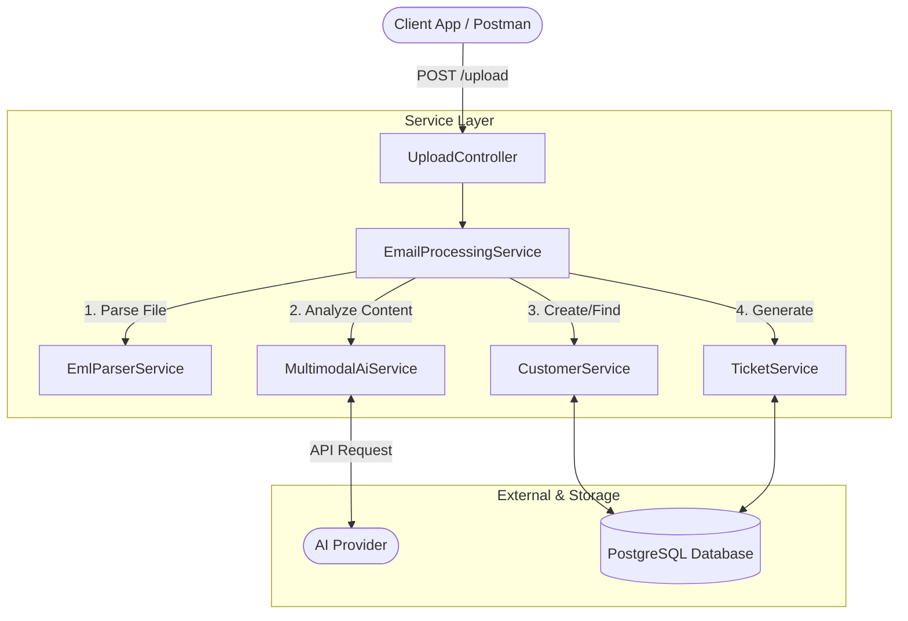
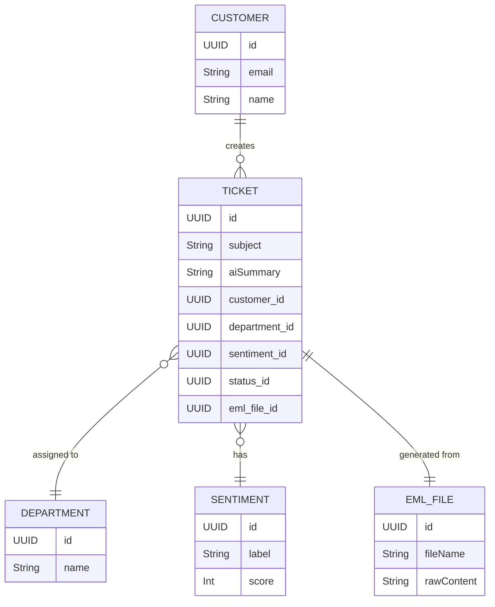

# Mail-2-Ticket

A backend service built with Spring Boot that converts `.eml` files into support tickets. The system reads the email files, extracts the text and attachments and uses an AI model to analyze the content and route the ticket to a department. 

Here's a quick preview:
---

## Architecture & Design

The application follows a standard multi-layer Spring Boot architecture, separating web requests, business logic, and database access. 


## How it works

1. A file is uploaded to the application.
2. The `EmlParserService` reads the file, extracting the sender, subject, body text and isolating any `AttachmentData`.
3. The `ParsedMail` content is sent to the `MultimodalAiService`, which interfaces with an AI model to evaluate the email text. The AI provides a summary of the entire email. The system prompt for this analysis can be modified in `AiAnalysisMapperImpl.java` at `buildPrompt()`.
4. The AI determines the `Sentiment` based on keywords and returns a score from 0 to 100. This score can be used to determine SLAs for the new ticket. The AI also assigns the appropriate `Department`.
5. The `CustomerService` checks if the sender exists, creating a new `Customer` record if they dont exist.
6. The `TicketService` generates a new `Ticket` linking the `Customer`, `EmlFile`, `Sentiment`, and `Department` and sets the initial `TicketStatus` to `OPEN`.
7. The API responds with an `UploadResponse` detailing the newly created ticket, email and customer.

---

## Entity Relations

The database schema separates business entities into distinct tables. Below is an overview of how the core entities relate to one another:


---

## API Endpoints

The application exposes standard REST endpoints for managing the ticket lifecycle, updating records, and uploading files.

| Method | Endpoint | Description |
| :--- | :--- | :--- |
| **POST** | `/api/upload` | Upload a multipart `.eml` file. Triggers parsing, AI analysis, and ticket creation. |
| **GET** | `/api/tickets` | Retrieve a paginated list of all generated tickets. |
| **GET** | `/api/tickets/{id}` | Retrieve details of a specific ticket. |
| **PUT** | `/api/tickets/{id}` | Update an existing ticket's details or status. |
| **GET** | `/api/customers` | Retrieve a list of all registered customers. |
| **GET** | `/api/customers/{id}` | Retrieve details of a specific customer. |
| **PUT** | `/api/customers/{id}` | Update an existing customer's information. |
| **GET** | `/api/eml-files/{id}` | Retrieve original parsed file metadata. |

---

## Project Structure
```text
├── docker-compose.yml          Infrastructure containerization (Database/Services)
├── mvnw / pom.xml              Maven build configuration and wrappers
└── src/
    ├── main/java/.../mail2ticket/
    │   ├── config/             Application and attachment properties
    │   ├── controller/         REST API endpoints for uploads, tickets, and customers
    │   ├── domain/             Database entities, DTOs, and internal models (AiEmlAnalysis, ParsedMail)
    │   ├── exception/          Error handling and custom exceptions
    │   ├── mapper/             Mapping interfaces for Entity-DTO conversion
    │   ├── repositories/       Spring Data database interfaces
    │   └── services/           Business logic, AI integration, and file parsing
    └── test/                   Unit testing suite
```

**Controllers** (`controller/`), expose RESTful endpoints including `UploadController` for file uploads, alongside standard controllers for `Ticket`, `Customer`, and `EmlFile`.

**Services** (`services/`), contain the application logic. The `EmailProcessingService` coordinates the workflow, utilizing the `EmlParserService` to read `.eml` files and the `MultimodalAiService` for analysis. 

**Domain** (`domain/`), organizes data structures into `entities` (e.g., `Ticket`, `Customer`, `Department`), `dto` for API responses, and `internal` models like `AiEmlAnalysis`.

---

## Setup

### Requirements

- Java 17 or newer
- Maven (or just use the provided `./mvnw` wrapper)
- Docker & Docker Compose (for local database setup)
- API Key for the Multimodal AI provider (Gemini is free)

### Configuration

The application uses `application.yml` for configuration. Set up your local environment variables or modify the YAML file directly:
```yaml
spring:
  datasource:
    url: jdbc:postgresql://localhost:5432/mail2ticket
    username: ${DB_USER}
    password: ${DB_PASS}
ai:
  provider:
    api-key: ${AI_API_KEY}
```

### Running locally

1. Start the required infrastructure using Docker:
```bash
docker compose up -d
```

2. Run the Spring Boot application using the Maven wrapper or your IDE:
```bash
./mvnw spring-boot:run
```

---

## Core Features

- **Email Processing**: Reads `.eml` files, extracting metadata, body text, and attachments via the `EmlParserService`.
- **AI Analysis**: Uses an AI model to summarize emails, assign a `Department`, and calculate a 0-100 `Sentiment` score based on keywords.
- **Error Handling**: Returns standard API responses using a `GlobalExceptionHandler` that manages errors like `ConflictException` and `ValidationException`.
- **Data Structure**: Separates database schemas from API responses using the `mapper` package to return `TicketDto` and `CustomerDto` objects.

---

## Planned Updates

- **Storage Service**: The `StorageService` is planned for a future update. It will upload an Excel file to AWS S3 containing the Upload Response Entities.
- **Testing**: Unit tests are currently limited (`CustomerServiceImplTest.java`). More tests for the service layer will be added in a future update.

---

## Notes

- The `GlobalExceptionHandler` catches unhandled exceptions and wraps them in an `ErrorResponse` payload.
- The `ProcessingStatus` entity tracks the lifecycle of an uploaded file to log failures during the parsing or AI analysis phases.
```
